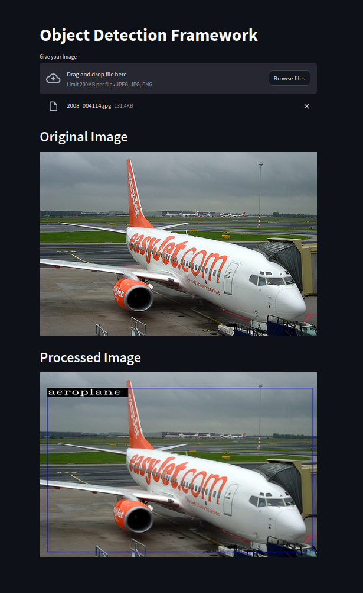

# Object_Detection_Application
This repository contains ready to run Streamlit application for Custom Object Detection Model built from Scratch.



## Installation
```
git clone git@github.com:BhavikShangari/Object_Detection_Application.git
cd Object_Detection_Application
```
## Download the file [here](https://drive.google.com/file/d/1ct8MpqkWMiI0ieN7EFPvSKQx1krvhZJh/view?usp=drive_link) and place it in the same directory.
```
pip install -r requirements.txt
streamlit run Home.py
```

After Installation and starting, go ahead with your experimentation with different Images present in images folder.
